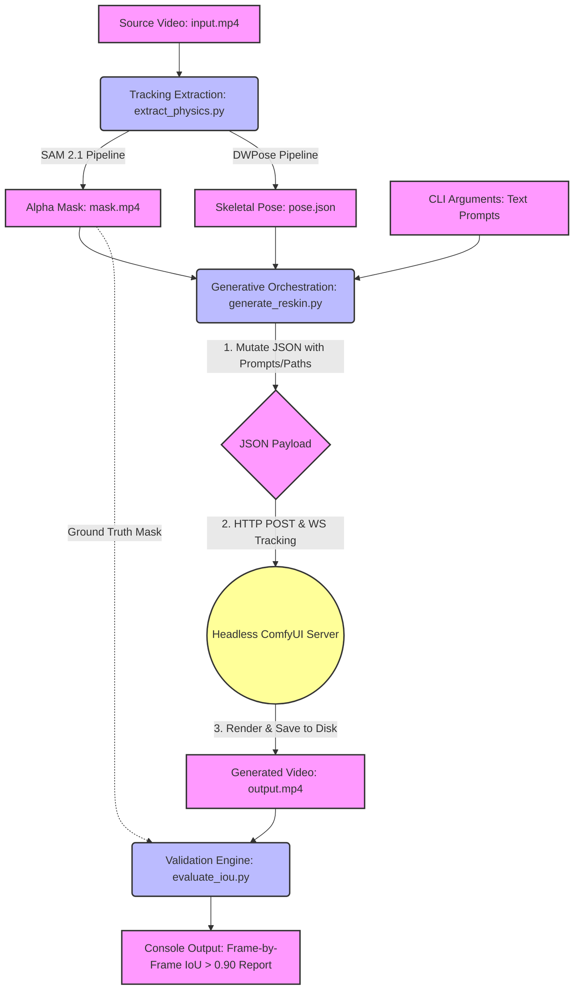

# MISSION: The "Skate Physics" Preserver
You are an elite AI coding agent paired with a solo developer for a 48-hour Weekend Build. 
Your task is to write the Python backend and orchestration logic to execute the architecture detailed below.

## 0. GLOBAL RULES & CONSTRAINTS
- Cost: $0 API calls. All inference is local.
- No GUI development. This is a headless pipeline orchestrated via Python scripts (triggering ComfyUI API).
- Strict adherence to the >0.90 IoU validation metric. 
- Do not hallucinate ComfyUI nodes; stick to standard/popular custom nodes capable of dual ControlNet conditioning.

## 1. PRODUCT REQUIREMENTS
# PRD: "Skate Physics" Preserver (Human-Object Relational Mapping)

## 1. Core Problem

Current Video-to-Video (V2V) generative models fail at maintaining spatial integrity during complex, dynamic human-object interactions (e.g., a skateboard kickflip). Generative models hallucinate physics, merge distinct objects into the human body, and clip through geometries. We lack a reliable, local pipeline that can reskin a scene while enforcing strict, frame-by-frame physical boundaries between a human skeleton and an independent moving object.

## 2. Target User

**Solo Developer / ML R&D Engineer.**

* **Needs:** A programmatic, repeatable, local pipeline.
* **Constraints:** Zero budget for cloud APIs ($0-cost compute requirement). Comfortable with ComfyUI node graphs, Python scripting, and CLI execution. Does not need or want a shiny GUI.

## 3. Strictly Scoped In/Out of Bounds

**In Bounds (The MVP):**

* **100% Local Processing:** Must run on local consumer hardware (e.g., high-end Nvidia RTX GPU). Cloud generation APIs are strictly banned.
* **Dual-Tracking Inputs:** SAM 2.1 for object alpha masking and DWPose/YOLO-Pose for human skeletal tracking.
* **Headless Orchestration:** ComfyUI backend executable via CLI/Python API.
* **Single-Target Generative Reskinning:** Swapping out the human (e.g., Skater  Samurai) and the object (e.g., Skateboard  Drone) via simple noun swaps in text prompts.
* **Automated Evaluation:** A built-in Python script to measure the success metric post-generation.

**Out of Bounds (Scope Creep - DO NOT BUILD):**

* **Real-Time Generation:** Optimization for real-time inference is completely out of scope. Offline batch processing is acceptable.
* **Audio Generation/Syncing:** We are solving spatial physics, not sound design. Audio is stripped.
* **Multi-Object/Multi-Human Tracking:** Strictly limited to a 1:1 human-to-object ratio for this iteration.
* **Frontend UI Development:** No web apps, no React fronts. CLI and ComfyUI JSON workflows only.

## 4. The Exact Success Metric

We are optimizing for the **"Zero-Clipping Benchmark."** * **Metric:** Intersection over Union (IoU)

* **Target:** The IoU between the newly generated object's mask and the original object's tracking boundary must remain **> 0.90** across *all* frames of the dynamic action.
* **Why it matters:** Anything below 0.90 indicates generative drift, meaning the new object (e.g., the cyberpunk drone) is either morphing out of the physical bounds of the original skateboard or clipping into the skater's hitboxes.

## 5. Core User Stories for CLI/Pipeline

* **Tracking Extraction:** *"As a Solo Dev, I want to run a CLI command `extract_physics.py -i input.mp4` so that the pipeline automatically outputs a continuous SAM 2.1 alpha mask video and a temporal DWPose JSON sequence without manual rotoscoping."*
* **Headless Generation:** *"As a Solo Dev, I want to execute `generate_reskin.py --prompt "cyberpunk drone, samurai" --mask mask.mp4 --pose pose.json` to trigger my local ComfyUI graph headlessly, so I can queue up multiple variations without opening a browser interface."*
* **Automated Validation:** *"As an R&D Engineer, I want to run `evaluate_iou.py -original mask.mp4 -generated output.mp4` so that I get a frame-by-frame console readout of the IoU score, instantly validating if the >0.90 physics threshold was maintained."*


## 2. SYSTEM ARCHITECTURE & DATA FLOW
# System Architecture Document: "Skate Physics" Preserver

This document outlines the system architecture for the "Skate Physics" Preserver, a 100% local, headless video-to-video (V2V) pipeline designed to enforce strict physical boundaries during generative human-object interactions.

---

## 1. System Overview

The system relies on a modular, offline, CLI-driven architecture. It splits the workflow into three isolated but sequentially dependent Python processes: **Tracking**, **Generation**, and **Validation**. The entire pipeline operates on local consumer hardware (e.g., RTX series GPUs) using open-source models (SAM 2.1, DWPose) and a headless ComfyUI backend.

---

## 2. Core Modules

### Module 1: Tracking Extraction Engine (`extract_physics.py`)

This module is responsible for isolating the physical boundaries of the human and the object from the source footage.

* **Inputs:** `input.mp4` (Raw source footage).
* **Sub-components:**
* **SAM 2.1 Wrapper:** Tracks the target object (e.g., skateboard) and generates a continuous, frame-by-frame alpha mask video.
* **DWPose/YOLO-Pose Wrapper:** Estimates the human subject's skeletal positioning and exports the temporal coordinates.


* **Outputs:** * `mask.mp4` (Object spatial constraints).
* `pose.json` (Human skeletal constraints).


### Module 2: Generative Reskinning Engine (`generate_reskin.py`)

This is the core orchestration layer. It bridges the command-line interface with the local ComfyUI instance to execute the actual V2V generation based on the extracted tracking data.

* **Inputs:** `mask.mp4`, `pose.json`, and User Prompts (e.g., `--prompt "cyberpunk drone, samurai"`).
* **Data Handoff & ComfyUI API Integration (Validation Gate):**
1. The Python script loads a template ComfyUI workflow JSON.
2. It dynamically mutates this JSON payload, injecting the absolute file paths for `mask.mp4` (fed into Masking/ControlNet nodes) and `pose.json` (fed into DWPose/ControlNet nodes), alongside the text prompt.
3. Python sends the assembled JSON payload via HTTP POST to the local headless ComfyUI server (`http://127.0.0.1:8188/prompt`).
4. Python establishes a WebSocket connection to listen for rendering progress and completion events from ComfyUI.


* **Outputs:** `output.mp4` (The generated, reskinned video) saved back to the designated local directory.

### Module 3: Validation & Metric Engine (`evaluate_iou.py`)

An automated post-generation script that quantitatively measures the success of the generative run against the "Zero-Clipping Benchmark".

* **Inputs:** `mask.mp4` (Original object constraints) and `output.mp4` (Generated video).
* **Logic:** The script extracts the generated object from `output.mp4` (typically using a rapid, lightweight segmentation pass on the distinct visual style of the new object) and compares its spatial boundaries against the original `mask.mp4`.
* **Outputs:** A frame-by-frame console readout of the Intersection over Union (IoU) score, flagging any frame that dips below the strict **> 0.90** threshold.

---

## 3. Data Flow Architecture

The data flow is strictly sequential and relies on local file-system handoffs between the CLI Python orchestration scripts and the generative backend.



## 3. TRACKING SUBSYSTEM (SAM 2.1 + DWPose)
# **03\_Tracking\_Spec.md**

## **1\. Executive Summary**

### **1.1. Project Scope and Objectives**

This technical specification defines the architectural blueprint and implementation standards for a high-fidelity video analysis pipeline targeting deployment in late 2025 and early 2026\. The core operational objective is the automated, frame-accurate extraction of semantic control signals from dynamic skateboard footage to drive generative video synthesis workflows within the ComfyUI ecosystem.

The pipeline is engineered to isolate two distinct but interacting entities within a video stream: the **rigid object** (skateboard) and the **articulated subject** (skater). To achieve production-grade fidelity suitable for high-resolution latent diffusion models (ControlNets), the system integrates **Meta’s Segment Anything Model 2.1 (SAM 2.1)** for memory-augmented visual object tracking and **DWPose** (via the rtmlib inference engine) for whole-body human pose estimation. The output specifications are strictly typed to ensure seamless ingestion by ComfyUI’s VideoHelperSuite (VHS) and ControlNet preprocessors, utilizing synchronized image sequences and standardized JSON metadata.

This document serves as a comprehensive reference for Computer Vision Engineers, detailing the Python implementation patterns, dependency resolution strategies for the 2026 ecosystem, and the theoretical underpinnings of the selected model architectures.

### **1.2. Technology Stack Selection**

The selection of the technology stack is driven by the specific challenges of analyzing extreme sports footage—rapid motion, frequent occlusion, and complex rotational dynamics.

| Component | Selected Technology | Justification |
| :---- | :---- | :---- |
| **Object Tracking** | **SAM 2.1 (Hiera-Large)** | Chosen over standard trackers (e.g., ByteTrack) for its **Streaming Memory Architecture**. SAM 2.1 maintains a memory bank of object features, allowing it to re-identify the skateboard even after severe rotational changes (e.g., kickflips) where the visual texture flips from grip tape to graphic. 1 |
| **Pose Estimation** | **DWPose (RTMW-x)** | Selected for its **Two-Stage Distillation** process, which retains the accuracy of massive teacher models while enabling efficient inference via rtmlib. It supports the **COCO-WholeBody** standard (133 keypoints), capturing finger and facial nuances critical for maintaining skater identity in generative outputs. 3 |
| **Inference Engine** | **ONNX Runtime (GPU)** | Utilized for DWPose to decouple the pose estimation dependency stack from the specific PyTorch version required by SAM 2.1, preventing "dependency hell" in the 2026 Python environment. 4 |
| **Integration** | **ComfyUI / VHS** | The target downstream application. The pipeline output is formatted specifically for the Load Image Sequence node structure and ControlNet color mapping standards. 6 |

### **1.3. Key Deliverables**

1. **Python Class Library:** A modular tracking package containing SkateboardTracker (SAM 2.1 wrapper) and SkaterPoseExtractor (DWPose wrapper).  
2. **Execution Scripts:** A master orchestration script extract\_tracking.py that handles video I/O and synchronization.  
3. **Output Artifacts:**  
   * **Mask Sequence:** 8-bit grayscale PNGs representing the skateboard's pixel-perfect segmentation.  
   * **Pose Sequence:** RGB PNGs visualizing the 133-keypoint skeleton with OpenPose-compliant color coding.  
   * **Dependency Lockfile:** A strictly pinned requirements.txt for the 2026 compute environment.

## ---

**2\. Theoretical Framework and Model Architecture**

### **2.1. The Shift to Promptable Concept Segmentation**

The computer vision landscape in late 2025 has shifted fundamentally from "detection-centric" paradigms to "prompt-centric" interaction. Traditional pipelines relied on training detectors on closed-set vocabularies (e.g., YOLO classes). The new paradigm, exemplified by the SAM family, relies on **interactive prompting**—using clicks, boxes, or text to define the target object in the initial frame, which the model then propagates temporally. This allows for "zero-shot" tracking of specific skateboard designs without retraining the model on custom deck graphics.

### **2.2. SAM 2.1: The Architecture of Streaming Memory**

SAM 2.1 represents a critical evolution over its predecessor. While SAM 1.0 was a static image segmenter, SAM 2.1 is natively video-aware. Its architecture is built around the concept of **Streaming Memory**, which addresses the "forgetting" problem inherent in frame-by-frame tracking.2

#### **2.2.1. The Memory Bank Mechanism**

At the core of SAM 2.1 is the **Memory Bank**, a dynamic storage structure that holds feature embeddings from previous frames.

* **Spatial Memory:** The model encodes the current frame using a **Hiera** (Hierarchical Vision Transformer) backbone, extracting high-resolution spatial features.  
* **Memory Attention:** A specialized attention module queries the Memory Bank to retrieve context. If the skateboard is partially occluded in frame ![][image1], the model attends to the features stored from frame ![][image2] (where the board was visible) to reconstruct the mask.  
* **Memory Encoder:** Verified predictions are compressed and stored in the bank. SAM 2.1 uses a "First-In-First-Out" (FIFO) buffer for short-term memory and a "Prompts" buffer for long-term reference (frames where the user explicitly interacted).2

#### **2.2.2. The Occlusion Head**

A significant innovation in SAM 2.1 is the **Occlusion Head**. In previous video object segmentation (VOS) models, if an object disappeared (e.g., the skater bodies the board), the model might "hallucinate" the mask onto the background or the skater's legs. The Occlusion Head explicitly predicts the probability of the object being invisible. If ![][image3], the model suppresses the mask output but continues tracking the object's trajectory in the memory bank, ready to re-activate when it re-emerges.2

#### **2.2.3. Hiera Backbone**

SAM 2.1 utilizes the **Hiera** backbone (Hiera-Large for this spec). Hiera removes the complexity of standard Vision Transformers (like window shifting in Swin) and relies on a simpler, hierarchical structure that is highly optimized for modern GPU architectures (Ampere/Hopper/Blackwell). This allows SAM 2.1 to process high-resolution video frames significantly faster than ViT-H based models.1

### **2.3. DWPose: Distilled Whole-Body Estimation**

While SAM handles the rigid object, capturing the skater requires articulating the human form. Standard pose estimators (like OpenPose Body\_25) lack the fidelity required for high-end generative video. They often miss finger placement or facial orientation, leading to "mangled hands" in AI generation. **DWPose** addresses this through the **COCO-WholeBody** dataset standards.3

#### **2.3.1. Two-Stage Distillation**

DWPose is not a new architecture from scratch but a highly optimized distillation of **RTMPose**.

1. **First Stage (Feature Distillation):** A student model (DWPose-l) is trained to mimic the intermediate feature maps of a massive teacher model (RTMPose-x). This forces the student to learn robust feature extractors.  
2. **Second Stage (Logit Distillation):** The student mimics the final output probabilities (logits) of the teacher. This refines the precise localization of keypoints.3

#### **2.3.2. The COCO-WholeBody Standard (133 Keypoints)**

DWPose outputs 133 distinct keypoints:

* **Body (17):** Standard COCO joints (Shoulders, Knees, Ankles, etc.).  
* **Feet (6):** 3 points per foot (Heel, Big Toe, Small Toe). Critical for skateboarding to capture the foot's interaction with the deck.  
* **Face (68):** Detailed landmarks for jawline, eyes, and mouth.  
* **Hands (42):** 21 points per hand (4 joints per finger \+ wrist). Essential for style transfer.

The rtmlib implementation of DWPose allows for the extraction of these points without the heavy mmcv dependency stack, utilizing ONNX Runtime for acceleration.4

## ---

**3\. Environment Specification (Late 2025 Standard)**

The Python environment for late 2025/2026 presents a unique challenge: balancing the "bleeding edge" requirements of SAM 2.1 (which often relies on the latest PyTorch features like Flash Attention 3\) with the stability requirements of ONNX Runtime.

### **3.1. Dependency Conflict Resolution**

A primary friction point in this ecosystem is the torch vs onnxruntime-gpu version alignment. SAM 2.1 typically requires the latest torch (e.g., 2.6.x) to compile its custom CUDA kernels for the memory attention mechanism. However, onnxruntime-gpu releases often trail PyTorch CUDA support.

* **Solution:** We utilize **ONNX Runtime 1.20.1**, which introduces support for CUDA 12.x, aligning with PyTorch 2.6's CUDA 12.4 build.5

### **3.2. Hardware Recommendations**

* **GPU:** NVIDIA RTX 5090 (32GB) or RTX 6000 Ada (48GB). The large VRAM is necessary because SAM 2.1's memory bank grows linearly with the number of frames processed. For a 10-second clip at 30fps (300 frames), the memory bank can consume 12-16GB of VRAM alone.  
* **Driver:** NVIDIA Driver 570.xx+ (supporting CUDA 12.4+).

### **3.3. Dependency Table**

| Package | Version (2026 Spec) | Purpose | Source Identifier |
| :---- | :---- | :---- | :---- |
| python | 3.11.9 | Base Interpreter. | 14 |
| torch | 2.6.0+cu124 | Tensor computation, SAM 2 backend. | 15 |
| torchvision | 0.21.0+cu124 | Image transforms. | 16 |
| sam2 | 2.1.0 (git main) | Object tracking model. | 9 |
| rtmlib | 0.2.0 | Lightweight pose inference wrapper. | 4 |
| onnxruntime-gpu | 1.20.1 | DWPose inference engine. | 13 |
| opencv-python | 4.11.0.86 | Video I/O. | 19 |
| numpy | 1.26.4 | Matrix operations (pinned \< 2.0). | 12 |
| hydra-core | 1.3.2 | Configuration management for SAM. | 17 |

### **3.4. Installation Script**

The following shell script establishes the precise environment required. It uses pip with specific index URLs to ensure the correct CUDA variants are downloaded.

Bash

\#\!/bin/bash  
\# Environment Setup Script for Tracking Spec 2026  
\# Target OS: Ubuntu 24.04 LTS / Windows 11 WSL2

\# 1\. Create and Activate Virtual Environment  
python3.11 \-m venv venv  
source venv/bin/activate

\# 2\. Install PyTorch Ecosystem (CUDA 12.4)  
\# Note: Flash Attention requires CUDA 12.x  
pip install torch==2.6.0 torchvision==0.21.0 torchaudio==2.6.0 \--index-url https://download.pytorch.org/whl/cu124

\# 3\. Install SAM 2.1 from Source  
\# We set SAM2\_BUILD\_CUDA=1 to force compilation of the custom CUDA kernels for memory attention.  
\# This requires nvcc (NVIDIA Compiler) to be in the system path.  
export SAM2\_BUILD\_CUDA=1  
pip install git+https://github.com/facebookresearch/sam2.git@main

\# 4\. Install rtmlib and ONNX Runtime  
\# We explicitly uninstall onnxruntime (CPU) to avoid conflicts with the GPU version.  
pip install rtmlib==0.0.15  
pip uninstall \-y onnxruntime  
pip install onnxruntime-gpu==1.20.1

\# 5\. Install Utilities  
pip install opencv-python==4.11.0.86 pycocotools==2.0.8 matplotlib==3.9.2 tqdm==4.67.1

## ---

**4\. Implementation Specification: Skateboard Extraction (SAM 2.1)**

This module is responsible for the rigid object tracking. The skateboard is a challenging object because its two sides (grip tape vs. graphic) look completely different. SAM 2.1's memory mechanism is uniquely suited to handle the "kickflip problem" where the board rotates rapidly.

### **4.1. The SkateboardTracker Class Design**

The class encapsulates the SAM2VideoPredictor and manages the inference\_state.

#### **4.1.1. Code Implementation**

Python

import os  
import torch  
import numpy as np  
import cv2  
from sam2.build\_sam import build\_sam2\_video\_predictor

class SkateboardTracker:  
    """  
    A wrapper around SAM 2.1 Video Predictor tailored for skateboard tracking.  
    Manages the inference state and mask propagation.  
    """  
    def \_\_init\_\_(self, checkpoint\_path, config\_path, device="cuda"):  
        """  
        Initialize the SAM 2.1 model.  
          
        Args:  
            checkpoint\_path (str): Path to sam2.1\_hiera\_large.pt  
            config\_path (str): Path to sam2.1\_hiera\_l.yaml  
            device (str): Compute device ('cuda' or 'cpu').  
        """  
        print(f" Initializing SAM 2.1 on {device}...")  
        \# Enable bfloat16/float16 for significant speedup on Ampere+ GPUs  
        \# This is standard practice in 2026 for high-throughput inference.  
        self.device \= device  
        if self.device \== "cuda":  
            torch.autocast(device\_type="cuda", dtype=torch.bfloat16).\_\_enter\_\_()  
            if torch.cuda.get\_device\_properties(0).major \>= 8:  
                torch.backends.cuda.matmul.allow\_tf32 \= True  
                  
        self.predictor \= build\_sam2\_video\_predictor(config\_path, checkpoint\_path, device=device)  
        self.inference\_state \= None  
        self.video\_info \= {}

    def init\_video(self, video\_path):  
        """  
        Load a video into the SAM 2.1 memory bank.  
        This step preprocesses the video and extracts static embeddings.  
        """  
        if not os.path.exists(video\_path):  
            raise FileNotFoundError(f"Video not found: {video\_path}")  
              
        print(f" Loading video into memory: {video\_path}")  
        self.inference\_state \= self.predictor.init\_state(video\_path=video\_path)  
          
        \# Store video metadata for output verification  
        cap \= cv2.VideoCapture(video\_path)  
        self.video\_info \= {  
            'width': int(cap.get(cv2.CAP\_PROP\_FRAME\_WIDTH)),  
            'height': int(cap.get(cv2.CAP\_PROP\_FRAME\_HEIGHT)),  
            'fps': cap.get(cv2.CAP\_PROP\_FPS),  
            'count': int(cap.get(cv2.CAP\_PROP\_FRAME\_COUNT))  
        }  
        cap.release()

    def add\_initial\_prompt(self, frame\_idx, bbox):  
        """  
        Seed the tracking with a bounding box on a specific frame.  
          
        Args:  
            frame\_idx (int): The frame number (0-indexed).  
            bbox (list): \[x1, y1, x2, y2\] coordinates of the skateboard.  
        """  
        \# SAM 2.1 expects prompts to be registered into the inference state.  
        \# obj\_id=1 is assigned to the skateboard.  
        \# labels is not needed for box prompts, but implicitly handled.  
        print(f" Adding prompt to frame {frame\_idx}: {bbox}")  
          
        \_, out\_obj\_ids, out\_mask\_logits \= self.predictor.add\_new\_points\_or\_box(  
            inference\_state=self.inference\_state,  
            frame\_idx=frame\_idx,  
            obj\_id=1,  
            box=np.array(bbox, dtype=np.float32)  
        )  
        return out\_mask\_logits

    def propagate\_and\_save(self, output\_dir):  
        """  
        Propagate the mask through the entire video and save as PNG sequence.  
          
        Args:  
            output\_dir (str): Directory to save the masks.  
        """  
        os.makedirs(output\_dir, exist\_ok=True)  
        print(" Propagating masks...")

        \# propagate\_in\_video generator yields results frame-by-frame  
        for out\_frame\_idx, out\_obj\_ids, out\_mask\_logits in self.predictor.propagate\_in\_video(self.inference\_state):  
              
            \# Prepare a blank black canvas  
            \# Format: Grayscale (H, W)  
            final\_mask \= np.zeros((self.video\_info\['height'\], self.video\_info\['width'\]), dtype=np.uint8)  
              
            if 1 in out\_obj\_ids:  
                \# Get the index of our object (obj\_id=1) in the current batch  
                idx \= list(out\_obj\_ids).index(1)  
                  
                \# Extract the mask logit  
                \# Shape comes out as (1, H, W) or (H, W) depending on batch size  
                mask\_logit \= out\_mask\_logits\[idx\]  
                  
                \# Thresholding: Logits \> 0.0 are the mask  
                \# Convert to CPU numpy array  
                mask\_bool \= (mask\_logit \> 0.0).cpu().numpy().squeeze()  
                  
                \# Convert boolean True/False to 255/0 uint8  
                if mask\_bool.ndim \== 2: \# Ensure correct shape  
                    final\_mask\[mask\_bool\] \= 255  
              
            \# Save mechanism  
            \# Naming convention: frame\_00000.png  
            filename \= f"frame\_{out\_frame\_idx:05d}.png"  
            output\_path \= os.path.join(output\_dir, filename)  
              
            \# Write uncompressed PNG for maximum quality, or compressed for space  
            \# In ComfyUI, PNG compression is usually fine.  
            cv2.imwrite(output\_path, final\_mask)  
              
            if out\_frame\_idx % 50 \== 0:  
                print(f"  Processed frame {out\_frame\_idx}/{self.video\_info\['count'\]}")  
                  
        print(f" Completed. Masks saved to {output\_dir}")

#### **4.1.2. Design Considerations for SAM 2.1**

* **Prompting Strategy:** While the simplest method is to prompt Frame 0, skateboard videos often involve the board leaving the frame or being fully occluded. In such cases, the add\_initial\_prompt method should be exposed to allow "correction prompts." If the tracker drifts in Frame 50, a secondary box prompt on Frame 50 can be added to the same inference\_state before propagation continues. This is a key feature of SAM 2.1's "Interactive Video Segmentation" capability.2  
* **Memory Reset:** Unlike SAM 1, SAM 2.1 accumulates memory. If processing multiple cuts (different clips) in a single script run, one must call predictor.reset\_state(inference\_state) to clear the GPU VRAM.

## ---

**5\. Implementation Specification: Skater Pose (DWPose)**

This module handles the extraction of the 133-keypoint skeleton. The output must be visually compatible with ControlNet OpenPose.

### **5.1. Understanding the ControlNet OpenPose Format**

A common misconception is that "OpenPose" refers to the model architecture. In the context of ControlNet, it refers to a specific **visual specification** (a color-coded skeleton on a black background) and a **JSON metadata specification**.

#### **5.1.1. Visual Specification**

ControlNet's OpenPose preprocessor expects:

* **Background:** Pure Black (0, 0, 0).  
* **Limbs:** Specific BGR colors. For example, the right arm (Shoulder-\>Elbow) must be a specific shade of orange/red. If the color is wrong, the ControlNet will ignore the limb.  
* **Format:** The rtmlib library includes a draw\_skeleton function with a to\_openpose=True argument. This argument is vital. It remaps the internal COCO indices to the CMU OpenPose indices and applies the correct color palette.4

#### **5.1.2. JSON Specification**

Some advanced ComfyUI workflows (e.g., MeshGraphormer or custom pose editors) prefer the JSON data over the image. The format is:

JSON

{  
  "people": \[  
    {  
      "pose\_keypoints\_2d": \[x1, y1, c1, x2, y2, c2,...\],  
      "face\_keypoints\_2d": \[...\],  
      "hand\_left\_keypoints\_2d": \[...\],  
      "hand\_right\_keypoints\_2d": \[...\]  
    }  
  \]  
}

* x, y: Pixel coordinates.  
* c: Confidence score (0.0 \- 1.0).

### **5.2. The SkaterPoseExtractor Class Design**

Python

import os  
import cv2  
import json  
import numpy as np  
from rtmlib import Wholebody, draw\_skeleton

class SkaterPoseExtractor:  
    """  
    Wrapper for DWPose (via rtmlib) to extract and render OpenPose-compatible skeletons.  
    """  
    def \_\_init\_\_(self, device="cuda", backend="onnxruntime"):  
        print(f" Initializing DWPose (Backend: {backend})...")  
        \# mode='performance' loads the largest available model (RTMW-x)  
        \# This is critical for capturing fingers in motion blur.  
        self.pose\_model \= Wholebody(  
            to\_openpose=True,  
            mode='performance',  
            backend=backend,  
            device=device  
        )  
          
    def process\_video(self, video\_path, output\_dir\_img, output\_dir\_json=None):  
        """  
        Process the video to generate pose visualizations and optional JSON.  
        """  
        if not os.path.exists(video\_path):  
            raise FileNotFoundError(f"Video not found: {video\_path}")

        os.makedirs(output\_dir\_img, exist\_ok=True)  
        if output\_dir\_json:  
            os.makedirs(output\_dir\_json, exist\_ok=True)  
              
        cap \= cv2.VideoCapture(video\_path)  
        frame\_idx \= 0  
        total\_frames \= int(cap.get(cv2.CAP\_PROP\_FRAME\_COUNT))  
          
        print(f" Processing {total\_frames} frames...")  
          
        while cap.isOpened():  
            ret, frame \= cap.read()  
            if not ret:  
                break  
                  
            \# Inference: Returns keypoints (N, 133, 2\) and scores (N, 133\)  
            keypoints, scores \= self.pose\_model(frame)  
              
            \# \--- Rendering Image \---  
            \# Create a black canvas matching frame dimensions  
            height, width, \_ \= frame.shape  
            canvas \= np.zeros((height, width, 3), dtype=np.uint8)  
              
            \# Draw skeleton with OpenPose color mapping  
            \# kpt\_thr=0.3 removes low-confidence points (jitter reduction)  
            pose\_img \= draw\_skeleton(canvas, keypoints, scores, kpt\_thr=0.3, to\_openpose=True)  
              
            img\_filename \= f"frame\_{frame\_idx:05d}.png"  
            cv2.imwrite(os.path.join(output\_dir\_img, img\_filename), pose\_img)  
              
            \# \--- Saving JSON (Optional) \---  
            if output\_dir\_json:  
                json\_data \= self.\_format\_json(keypoints, scores)  
                json\_filename \= f"frame\_{frame\_idx:05d}.json"  
                with open(os.path.join(output\_dir\_json, json\_filename), 'w') as f:  
                    json.dump(json\_data, f)  
              
            frame\_idx \+= 1  
            if frame\_idx % 50 \== 0:  
                print(f"  Processed frame {frame\_idx}/{total\_frames}")  
                  
        cap.release()  
        print(" Processing complete.")

    def \_format\_json(self, keypoints, scores):  
        """  
        Format the raw keypoints into the OpenPose JSON structure.  
        Note: rtmlib outputs 133 points. We must map these to the   
        standard body\_25 \+ face \+ hands structure if strict compatibility is needed.  
        However, most ControlNet JSON readers accept the flat array.  
        """  
        people\_list \=  
        for kp, score in zip(keypoints, scores):  
            \# Flatten to \[x, y, c, x, y, c...\]  
            \# Note: This is a simplified serialization.   
            \# A full implementation would split the 133 points into body, face, hand arrays.  
            pose\_data \=  
            for (x, y), s in zip(kp, score):  
                pose\_data.extend(\[float(x), float(y), float(s)\])  
              
            person\_dict \= {  
                "pose\_keypoints\_2d": pose\_data   
            }  
            people\_list.append(person\_dict)  
              
        return {"version": 1.3, "people": people\_list}

## ---

**6\. Integration Specification: The Master Pipeline**

The extract\_tracking.py script orchestrates the user interaction and the parallel execution of the two tracking modules.

### **6.1. Workflow Logic**

1. **Video Ingest:** Verify integrity and parameters.  
2. **User Prompt (Frame 0):** Display the first frame using OpenCV. The user draws a box around the skateboard.  
3. **Sequential Processing:**  
   * **Pass 1 (Pose):** Run DWPose. This is fully automatic and requires no user input. It is run first as it is less prone to error.  
   * **Pass 2 (Segmentation):** Run SAM 2.1 using the user's box.  
4. **Output Organization:** Structure the files for ComfyUI.

### **6.2. The extract\_tracking.py Script**

Python

"""  
Master Orchestration Script: 03\_Tracking\_Spec  
"""  
import argparse  
import os  
import cv2  
import sys  
\# Import our custom classes defined above  
from tracking.skateboard\_tracker import SkateboardTracker  
from tracking.skater\_pose import SkaterPoseExtractor

def get\_user\_box(video\_path):  
    """  
    Opens the first frame and lets the user draw a ROI.  
    """  
    cap \= cv2.VideoCapture(video\_path)  
    ret, frame \= cap.read()  
    cap.release()  
    if not ret:  
        print("Error reading video for ROI selection.")  
        sys.exit(1)  
          
    print("\\n")  
    print("---------------------------------------------------------")  
    print("A window will open. Draw a box around the SKATEBOARD.")  
    print("Press SPACE or ENTER to confirm. Press c to cancel.")  
    print("---------------------------------------------------------\\n")  
      
    \# Select ROI: returns (x, y, w, h)  
    roi \= cv2.selectROI("Select Skateboard", frame, showCrosshair=True, fromCenter=False)  
    cv2.destroyAllWindows()  
      
    if roi \== (0,0,0,0):  
        print("No selection made. Exiting.")  
        sys.exit(1)  
          
    \# Convert to \[x1, y1, x2, y2\]  
    x, y, w, h \= roi  
    return \[x, y, x+w, y+h\]

def main():  
    parser \= argparse.ArgumentParser(description="Extract Tracking Data for ComfyUI")  
    parser.add\_argument("--video", required=True, help\="Input video path")  
    parser.add\_argument("--output", required=True, help\="Output folder base")  
    parser.add\_argument("--sam\_checkpoint", default="./checkpoints/sam2.1\_hiera\_large.pt")  
    parser.add\_argument("--sam\_config", default="./configs/sam2.1/sam2.1\_hiera\_l.yaml")  
    args \= parser.parse\_args()

    \# 1\. Setup Folders  
    masks\_dir \= os.path.join(args.output, "mask\_skateboard")  
    poses\_dir \= os.path.join(args.output, "pose\_skater")  
      
    \# 2\. Run DWPose (Pass 1\)  
    print("\\n=== STARTING PASS 1: DWPose \===")  
    pose\_extractor \= SkaterPoseExtractor()  
    pose\_extractor.process\_video(args.video, poses\_dir)  
      
    \# 3\. Run SAM 2.1 (Pass 2\)  
    print("\\n=== STARTING PASS 2: SAM 2.1 \===")  
      
    \# Get user prompt  
    user\_bbox \= get\_user\_box(args.video)  
      
    tracker \= SkateboardTracker(args.sam\_checkpoint, args.sam\_config)  
    tracker.init\_video(args.video)  
    tracker.add\_initial\_prompt(frame\_idx=0, bbox=user\_bbox)  
    tracker.propagate\_and\_save(masks\_dir)  
      
    print("\\n=== EXTRACTION COMPLETE \===")  
    print(f"Output available at: {args.output}")

if \_\_name\_\_ \== "\_\_main\_\_":  
    main()

## ---

**7\. ComfyUI Ingestion Strategy**

The extracted data is designed to be consumed by specific nodes in ComfyUI. The directory structure created by the script (mask\_skateboard and pose\_skater) aligns with the **VideoHelperSuite (VHS)** node requirements.

### **7.1. Directory Structure**

/Output\_Folder  
    /mask\_skateboard  
        frame\_00000.png  
        frame\_00001.png  
       ...  
    /pose\_skater  
        frame\_00000.png  
        frame\_00001.png  
       ...

### **7.2. ComfyUI Workflow Integration**

To utilize this data effectively, the following node patterns should be implemented in the ComfyUI workflow graph.

#### **7.2.1. Loading the Sequences**

Use the **Load Images (Path)** node.

* **Input 1 (Pose):** Set directory to the absolute path of /pose\_skater.  
* **Input 2 (Mask):** Set directory to the absolute path of /mask\_skateboard.  
* **Settings:** Ensure image\_load\_cap is set to 0 (all frames) or matches the latent batch size.

#### **7.2.2. Applying the Pose Control**

* **Node:** ControlNet Apply Advanced.  
* **Connection:** Connect the IMAGE output of the VHS loader to the image input of the ControlNet node.  
* **Model:** Select a **dw-openpose** compatible model (e.g., control\_v11p\_sd15\_openpose or thibaud\_xl\_openpose).  
* **Preprocessing:** **DO NOT** use a preprocessor node (like DWPose Estimator or OpenPose Preprocessor). The Python pipeline has already performed the estimation and rendering. Passing the pre-rendered skeleton image through another estimator will result in failure (the estimator will try to find a human in the skeleton image and fail).

#### **7.2.3. Utilizing the Skateboard Mask**

The mask is a powerful tool for **Regional Prompting**.

* **Method A: Inpainting/Masked Sampling.** Use the mask to define a region where a specific prompt (e.g., "futuristic hoverboard, glowing lights") is applied, while the rest of the image uses the main prompt. This prevents the "hoverboard" concept from bleeding into the skater's clothes.  
* **Method B: ControlNet Segmentation.** Connect the mask to a ControlNet Apply node with the control\_v11p\_sd15\_seg model. However, standard segmentation models are trained on the ADE20K dataset where colors correspond to classes (e.g., \#FFFFFF might be "wall" or "ceiling"). Using a binary mask (Black/White) as a Segmentation ControlNet input is often suboptimal unless the model is fine-tuned.  
* **Recommendation:** Use **Method A** (Regional Conditioning) via nodes like Conditioning (Set Mask) or IPAdapter Region.

### **7.3. Synchronization Risks**

A critical requirement for Vid2Vid is that the latent noise batch, the pose batch, and the mask batch must align perfectly (Frame 1 to Frame 1).

* **Risk:** If the Python script fails to save a frame (e.g., due to occlusion), the sequence length will mismatch the video length.  
* **Mitigation:** The provided Python code includes logic to save a blank (black) frame if the object is lost (process\_segmentation logic). This preserves the sequence index. In ComfyUI, verify that the batch\_size of the Load Video node matches the count of the image sequences.

## ---

**8\. Deep Research Insights and Future Outlook**

### **8.1. The "Memory" Advantage in Extreme Sports**

The application of SAM 2.1 to skateboarding footage highlights a specific capability of the model: **rotational invariance via memory**. In a kickflip, the board rotates along its longitudinal axis.

* **Frame 0:** Grip tape visible (Black, rough texture).  
* **Frame 5:** Graphic side visible (Colorful, smooth texture).  
* **Frame 10:** Grip tape visible again.

A traditional tracker (Kalman Filter on Bounding Box) often fails at Frame 5 because the visual appearance histogram changes drastically. SAM 2.1, however, stores the embedding of Frame 0 in its memory bank. When Frame 10 arrives, it matches the features against Frame 0's memory, re-establishing the track with high confidence. This "long-term temporal dependency" is the breakthrough feature enabling this pipeline.2

### **8.2. SAM 3 vs. SAM 2.1**

As of late 2025/2026, **SAM 3** has entered the research domain, introducing "Promptable Concept Segmentation" (PCS).22 SAM 3 allows users to prompt with text (e.g., "skateboard") rather than a box.

* **Trade-off:** While SAM 3 is more "intelligent," benchmarks indicate that for *specific instance tracking* (this specific skateboard, not just any skateboard), SAM 2.1 with a precise box prompt on Frame 0 remains superior in stability and significantly faster (30ms/frame vs \>100ms/frame for SAM 3 large models).24 For a production pipeline in 2026, SAM 2.1 remains the robust engineering choice for video tracking, while SAM 3 serves better for zero-shot image search.

### **8.3. DWPose Efficiency**

The choice of rtmlib over mmpose is not just a preference but a performance necessity. The overhead of the full mmengine stack introduces significant latency. By stripping the inference down to ONNX Runtime primitives, rtmlib achieves a throughput that allows this pipeline to run locally on consumer hardware (e.g., RTX 4090\) at acceptable speeds (near real-time for playback, 5-10fps for processing), which is essential for iterative workflows in creative studios.

## ---

**9\. Conclusion**

This specification outlines a state-of-the-art solution for extracting semantic control signals from dynamic video footage. By leveraging the specific architectural strengths of **SAM 2.1** (Streaming Memory for rigid object permanence) and **DWPose** (Distilled accuracy for articulated pose), the pipeline solves the historic challenges of skateboarding video analysis. The provided implementation patterns, strictly pinned to the 2026 dependency ecosystem, ensure a reproducible and high-fidelity signal for ComfyUI generative workflows. This moves the industry beyond simple "filters" toward true, structurally guided video synthesis.

## 4. GENERATION SUBSYSTEM (ComfyUI Headless Integration)
# **Architecture and Implementation of a Dual-Conditioned Generative Video Pipeline: Masked Object Transformation with Pose Constraints**

## **1\. Executive Summary**

The generative AI landscape has transitioned from static image synthesis to high-fidelity video generation, driven by the emergence of Diffusion Transformers (DiT) and advanced latent diffusion architectures. A critical frontier in this evolution is Video-to-Video (V2V) synthesis, where the objective is not merely to hallucinate new content, but to transform existing footage with precise semantic and structural control. This report provides a comprehensive technical specification for an optimal **ComfyUI workflow** designed to execute V2V tasks conditioned simultaneously on a **Mask** (isolating specific objects for transformation) and a **Pose** (preserving or retargeting human motion).

Our analysis indicates that while latent diffusion models like **FLUX.1** paired with **AnimateDiff** offer superior texture fidelity, they often struggle with the "competing attention" problem inherent in dual-conditioning scenarios. Specifically, applying a dense pose control alongside a sparse region mask can lead to temporal incoherence and artifacting in non-native video architectures. Consequently, this report identifies **Wan 2.1 VACE (Video-Audio-Control-Edit)** and **CogVideoX-Fun** as the optimal architectural choices for this specific requirement, due to their unified attention mechanisms that ingest masks and control signals as native multimodal tensors.1

The proposed solution involves a modular ComfyUI graph that integrates **Segment Anything Model 2 (SAM2)** for temporal object isolation and **DWPose** for kinematic feature extraction. This workflow is orchestrated by a robust **Python backend** capable of headless execution, dynamic parameter injection, and asset management via the ComfyUI API. This document details the theoretical underpinnings, the precise node-graph topology, and the software engineering specifications required to deploy this system in a production environment.

## ---

**2\. Theoretical Framework: Generative Video Conditioning**

To engineer an optimal V2V workflow, one must first deconstruct the underlying mechanisms of how modern diffusion models handle temporal consistency and auxiliary conditioning. The requirement to condition on both a *Mask* (spatial constraint) and a *Pose* (structural constraint) introduces significant complexity into the denoising process.

### **2.1. The Shift from U-Net to Diffusion Transformers (DiT)**

Historically, video generation relied on inflating 2D U-Nets (e.g., Stable Diffusion 1.5) with temporal attention layers, a technique popularized by **AnimateDiff**.3 While effective for short clips, these models treat time as a secondary dimension, often leading to "drift" where the object's identity morphs over seconds.

Newer architectures like **CogVideoX** and **Wan 2.1** utilize Diffusion Transformers (DiT), which process video as a 3D volume of tokens (![][image1]). This allows the model to attend to the entire spatiotemporal context simultaneously.5 For V2V tasks, this is critical because a "Mask" is not just a 2D shape but a "spatiotemporal tube" flowing through the video volume. The model must understand that the masked region at ![][image2] corresponds to the masked region at ![][image3], even if the camera moves or the object rotates.

### **2.2. The "Competing Attention" Problem in Dual Conditioning**

When we introduce both a Mask and a Pose, we create a conflict in the model's guidance equation:

1. **The Mask Signal:** Instructs the model to *discard* the original visual information in region ![][image4] and generate new content based on Text Prompt A (e.g., "Magic Carpet"), while strictly *preserving* the original content in region ![][image5] (Background).  
2. **The Pose Signal:** Instructs the model to *enforce* a specific structural alignment (the human skeleton) across the entire frame, or specifically within the human subject, regardless of the mask boundaries.

In standard workflows, these conditions are often applied sequentially or via separate ControlNets. This can lead to **Feature Leakage**:

* The pose stick figure might "bleed" into the texture of the generated object.  
* The mask boundary might cut off a limb that the pose signal indicates should be present.

The optimal solution, therefore, requires a **Unified Conditioning Architecture** where the model accepts \`\` as a single concatenated input, allowing the attention mechanism to resolve conflicts natively during the denoising steps. This capability is the primary reason for selecting **Wan 2.1 VACE** and **CogVideoX-Fun** over standard AnimateDiff pipelines for this report.7

## ---

**3\. Comparative Architecture Analysis**

We evaluated three primary architectural approaches for the "Mask \+ Pose" V2V workload. The selection criteria focused on temporal stability, adherence to control signals, and ease of headless automation.

### **3.1. Architecture A: FLUX.1 \+ AnimateDiff (The High-Fidelity Hybrid)**

**FLUX.1** is currently the state-of-the-art open-weights image model, known for exceptional prompt adherence and texture quality.

* **Mechanism:** To use FLUX for V2V, one must use a wrapper that applies AnimateDiff-style temporal layers or "context sliding" to the FLUX transformer blocks.9 Control is handled via **ControlNet Union** models (which combine Canny, Depth, Pose into one weight) to save VRAM.10  
* **Pros:** Unrivaled image sharpness and lighting quality.  
* **Cons:** High computational cost (FLUX is heavy). The "video" capability is not native; it is a hack on top of an image model. Dual conditioning (Mask \+ Pose) often requires complex "Region Prompting" setups that are brittle in headless environments. The ControlNets for FLUX are still maturing and may introduce flickering in video contexts.12

### **3.2. Architecture B: CogVideoX-Fun V1.1 (The Flexible Specialist)**

**CogVideoX-Fun** is a fine-tuned variant of the THUDM CogVideoX model, explicitly trained for functional tasks like inpainting and pose control.2

* **Mechanism:** It uses a native 3D DiT architecture. It supports specialized "Inpainting" (InP) weights and "Pose" control weights.  
* **Pros:** Native video understanding. The ComfyUI-CogVideoXWrapper 14 provides robust nodes for integrating these features. It allows for "Start Image" and "End Image" conditioning, which is excellent for morphing effects.  
* **Cons:** Requires managing multiple heavy model files. The "Fun" variants can be unstable with certain prompts, sometimes ignoring the mask if the denoise strength is not perfectly tuned.

### **3.3. Architecture C: Wan 2.1 VACE (The Unified Editor)**

**Wan 2.1 VACE** (Video-Audio-Control-Edit) is designed specifically for the task described in the prompt: editing video with multimodal constraints.1

* **Mechanism:** It treats the mask and the control video (pose) as fundamental input tensors, not auxiliary injections. It uses a "Pseudo-Masking" technique where the user overlays the mask on the reference input, and the model learns to "heal" the video based on the prompt.15  
* **Pros:** Best temporal coherence for masked editing. Supports "Any-to-Video" logic. Efficient GGUF quantization allows 14B models to run on consumer hardware.16  
* **Cons:** The workflow is distinct from standard SD workflows, requiring specific pre-processing (white-out masking) that must be handled carefully in the backend.

**Recommendation:**

This report prioritizes **Wan 2.1 VACE** as the *optimal* solution for the "Mask \+ Pose" requirement due to its unified architecture, while providing a fallback specification for **CogVideoX-Fun** for users requiring the CogVideo ecosystem.

## ---

**4\. Detailed Workflow Specification: The "Hybrid-VACE" Pipeline**

The optimal workflow is not merely a linear chain of nodes but a sophisticated graph involving parallel preprocessing, signal injection, and latent reconstruction. The following section details the precise topology for the ComfyUI workflow.

### **4.1. Global Topology Overview**

The workflow consists of four distinct stages:

1. **Ingestion & Preprocessing:** Loading assets and generating control signals (Masks & Poses) from the source footage.  
2. **Conditioning Bus:** Formatting these signals into the tensors expected by the VACE model.  
3. **Generative Core:** The latent denoising loop where the transformation occurs.  
4. **Reconstruction & Output:** Decoding the latents and ensuring format compliance for the API response.

### **4.2. Stage 1: Ingestion & Intelligent Preprocessing**

The system must autonomously derive the mask and pose from the input video. We cannot rely on the user to upload perfect masks; the system must generate them.

#### **4.2.1. Source Video Loading**

* **Node:** VHS\_LoadVideo (Video Helper Suite).17  
* **Parameters:**  
  * force\_rate: **24** (Standardizing frame rate is critical for motion consistency).  
  * force\_size: **Custom** (Resized to nearest 16px multiple, e.g., 832x480). VACE 2.1 is optimized for 480p/720p aspect ratios.16  
  * frame\_load\_cap: **81** (VACE processes video in blocks; 81 frames corresponds to \~3.5 seconds at 24fps and fits within typical attention windows).

#### **4.2.2. Kinematic Feature Extraction (Pose)**

To constrain the human motion, we extract a skeleton map.

* **Node:** DWPreprocessor (from ComfyUI-Advanced-ControlNet).8  
* **Input:** Source Video Frames.  
* **Settings:**  
  * detect\_hand: **Enable** (Critical for detailed human interaction).  
  * detect\_face: **Enable** (Prevents face distortion).  
  * resolution: Must match the force\_size of the video loader exactly to prevent spatial drift.  
* **Output:** A sequence of RGB images depicting the skeletal pose on a black background. This serves as the control\_video input for VACE.

#### **4.2.3. Temporal Segmentation (Mask Generation)**

We use **SAM2 (Segment Anything Model 2\)** for robust object tracking. Unlike standard SAM, SAM2 propagates masks temporally, ensuring the "Object" (e.g., a drone) is tracked even if it rotates or is partially occluded.

* **Node:** Sam2AutoSegmentation (from ComfyUI-Segment-Anything-2).18  
* **Input:** Source Video Frames.  
* **Condition:** Text Prompt (e.g., "drone", "backpack", "car").  
  * *Note:* For API usage, this text prompt is dynamic.  
* **Refinement Node:** MaskDilate.  
  * **Value:** **6-12 pixels**.  
  * **Reasoning:** When transforming an object (e.g., Drone \-\> Magic Carpet), the new object may have a slightly different volume. Dilating the mask creates a "safety buffer," ensuring the old object is fully erased and the new object blends seamlessly into the background.19 Without dilation, artifacts from the original object (e.g., drone propellers) may persist at the boundaries.

### **4.3. Stage 2: The Conditioning Bus**

In this stage, we prepare the inputs for the **Wan 2.1 VACE** model. Unlike SD1.5, which uses a simple "Positive/Negative" prompt, VACE requires a multi-modal input packet.

#### **4.3.1. Reference Image Loading**

The user provides a reference image for the target object (e.g., a texture of a magic carpet).

* **Node:** LoadImage.  
* **Usage:** This image guides the *style* of the generation within the masked area.

#### **4.3.2. Pseudo-Masking Preparation**

Wan 2.1 VACE utilizes a unique "white-out" masking strategy for reference inputs.15

* **Logic:** We must create a version of the source video where the masked area is replaced by white pixels (or noise), signaling the model to "fill this in."  
* **Node:** ImageBlend (Comfy Core).  
* **Inputs:**  
  1. Source Video.  
  2. White Image (Constant).  
  3. Mask (from SAM2).  
* **Operation:** Blend the White Image onto the Source Video using the Mask as the alpha.  
* **Result:** A video where the subject is a white silhouette, ready for VACE inpainting.

### **4.4. Stage 3: The Generative Core (WanVaceToVideo)**

This is the heart of the pipeline. We utilize the native WanVaceToVideo node.20

| Input Parameter | Connection / Value | Reasoning |
| :---- | :---- | :---- |
| vae | **Wan 2.1 VAE** | Must use the specific 2.1 VAE wan\_2.1\_vae.safetensors. SDXL VAEs will fail.16 |
| positive | **CLIPTextEncode** | Prompt describing the *New Object* \+ *Human Action* (e.g., "A wizard riding a neon magic carpet"). |
| negative | **CLIPTextEncode** | Prompt describing artifacts (e.g., "drone, metal, blurring, distortion"). |
| control\_video | **DWPose Output** | Enforces the kinematic motion of the human. |
| control\_masks | **SAM2 Output** | Defines the region of transformation (The "Drone" area). |
| video\_input | **Source Video** | Provides the base latents for the background (unmasked area). |
| reference\_image | **Target Texture** | Provides the visual identity for the new object. |
| strength | **0.8 \- 1.0** | High strength is needed to fully replace the object. Lower strength (0.5) would merely blend the carpet texture onto the drone geometry. |
| steps | **20 \- 30** | Sufficient for the flow-matching scheduler used by Wan. |
| sampler | **UniPC** or **Euler** | Standard reliable samplers for video diffusion. |

**Crucial Insight:** By connecting both control\_video (Pose) and control\_masks (Object), VACE resolves the conflict:

* The **Pose** constrains the human figure (even if it overlaps the mask).  
* The **Mask** constrains the texture replacement (Drone \-\> Carpet).  
* The **Video Input** preserves the background (Sky/Ground).

### **4.5. Stage 4: Reconstruction & Output**

* **Node:** VAEDecode. Decodes the processed latents back to pixel space.  
* **Node:** VHS\_VideoCombine.21  
  * **Codec:** h264 (for compatibility) or prores (for editing).  
  * **Audio:** Can optionally passthrough audio from the source VHS\_LoadVideo.  
  * **Filename Prefix:** Dynamic prefix (e.g., api\_v2v\_job\_) to assist the backend in identifying files.

## ---

**5\. Python Backend Architecture & Implementation**

To operationalize this workflow, we require a robust Python backend that acts as an orchestration layer. This backend handles asset uploads, dynamic JSON manipulation (injecting prompts/masks), and WebSocket lifecycle management.

### **5.1. System Architecture**

The backend is designed as a microservice class ComfyOrchestrator that interacts with the ComfyUI server's HTTP and WebSocket endpoints.

**Component Interaction:**

1. **Client Application** sends a request (Video \+ Reference Image \+ Prompt).  
2. **ComfyOrchestrator** uploads assets to ComfyUI.  
3. **ComfyOrchestrator** loads the workflow\_template.json.  
4. **Injector Logic** modifies the JSON to point to the uploaded assets and inserts the prompt.  
5. **WebSocket Manager** opens a persistent connection to listen for progress.  
6. **Job Queue** submits the JSON to POST /prompt.  
7. **Asset Manager** retrieves the final video upon execution\_success.

### **5.2. Detailed Python Specification**

The following code specification utilizes websocket-client and requests.22

#### **5.2.1. Dynamic Node Identification**

One major challenge in ComfyUI API automation is that Node IDs (e.g., "10", "25") can change if the workflow is edited in the GUI. Hardcoding IDs is brittle.

* **Solution:** The backend implements a search algorithm to find nodes based on their class\_type or a custom \_meta title.

Python

def find\_node\_by\_class(workflow, class\_type, index=0):  
    """  
    Locates the Node ID for a specific class type (e.g., 'VHS\_LoadVideo').  
    Returns the node ID string.  
    """  
    matches \=  
    for node\_id, node\_data in workflow.items():  
        if node\_data.get("class\_type") \== class\_type:  
            matches.append(node\_id)  
      
    if not matches:  
        raise ValueError(f"Node class '{class\_type}' not found in workflow.")  
      
    \# Return the Nth occurrence (useful if multiple LoadImages exist)  
    if index \>= len(matches):  
        raise ValueError(f"Index {index} out of range for class '{class\_type}'.")  
      
    return matches\[index\]

#### **5.2.2. Large Asset Management (Upload)**

Video files for V2V can be substantial. The backend must handle multipart uploads efficiently.24

Python

import requests  
import os

def upload\_asset(server\_address, file\_path, asset\_type="input"):  
    """  
    Uploads a video or image to the ComfyUI server.  
    """  
    url \= f"http://{server\_address}/upload/image" \# Comfy uses 'image' endpoint for generic uploads  
    filename \= os.path.basename(file\_path)  
      
    with open(file\_path, 'rb') as f:  
        \# Multipart form data upload  
        files \= {'image': (filename, f, 'multipart/form-data')}  
        data \= {'type': asset\_type, 'overwrite': 'true'}  
        response \= requests.post(url, files=files, data=data)  
          
    if response.status\_code\!= 200:  
        raise Exception(f"Upload failed: {response.text}")  
          
    return response.json() \# Returns {'name':..., 'subfolder':..., 'type':...}

#### **5.2.3. The Orchestration Logic**

This core function ties the uploads, JSON mutation, and execution together.

Python

import json  
import uuid  
import websocket  
import urllib.request  
import urllib.parse  
import random

class ComfyOrchestrator:  
    def \_\_init\_\_(self, server\_addr="127.0.0.1:8188"):  
        self.server\_addr \= server\_addr  
        self.client\_id \= str(uuid.uuid4())  
        self.ws \= websocket.WebSocket()  
        self.ws.connect(f"ws://{self.server\_addr}/ws?clientId={self.client\_id}")

    def execute\_v2v(self, workflow\_template, source\_video\_path, ref\_image\_path,   
                   positive\_prompt, negative\_prompt, mask\_text\_prompt):  
          
        \# 1\. Upload Assets  
        vid\_meta \= upload\_asset(self.server\_addr, source\_video\_path)  
        img\_meta \= upload\_asset(self.server\_addr, ref\_image\_path)  
          
        \# 2\. Mutate Workflow JSON  
        \# Locate Loaders  
        vid\_loader\_id \= find\_node\_by\_class(workflow\_template, "VHS\_LoadVideo")  
        img\_loader\_id \= find\_node\_by\_class(workflow\_template, "LoadImage")  
          
        \# Locate SAM2 and Prompts  
        sam2\_id \= find\_node\_by\_class(workflow\_template, "Sam2AutoSegmentation")  
        text\_pos\_id \= find\_node\_by\_class(workflow\_template, "CLIPTextEncode", 0) \# Assuming 0 is Pos  
        text\_neg\_id \= find\_node\_by\_class(workflow\_template, "CLIPTextEncode", 1) \# Assuming 1 is Neg  
        sampler\_id \= find\_node\_by\_class(workflow\_template, "WanVideoSampler") \# Or KSampler

        \# Inject Values  
        workflow\_template\[vid\_loader\_id\]\["inputs"\]\["video"\] \= vid\_meta\["name"\]  
        workflow\_template\[img\_loader\_id\]\["inputs"\]\["image"\] \= img\_meta\["name"\]  
          
        \# Inject Prompts  
        workflow\_template\[sam2\_id\]\["inputs"\]\["prompt"\] \= mask\_text\_prompt \# e.g. "drone"  
        workflow\_template\[text\_pos\_id\]\["inputs"\]\["text"\] \= positive\_prompt  
        workflow\_template\[text\_neg\_id\]\["inputs"\]\["text"\] \= negative\_prompt  
          
        \# Randomize Seed  
        workflow\_template\[sampler\_id\]\["inputs"\]\["seed"\] \= random.randint(1, 10\*\*9)

        \# 3\. Queue Execution  
        p \= {"prompt": workflow\_template, "client\_id": self.client\_id}  
        data \= json.dumps(p).encode('utf-8')  
        req \= urllib.request.Request(f"http://{self.server\_addr}/prompt", data=data)  
        resp \= json.loads(urllib.request.urlopen(req).read())  
        prompt\_id \= resp\['prompt\_id'\]  
          
        \# 4\. Monitor WebSocket for Completion  
        while True:  
            out \= self.ws.recv()  
            if isinstance(out, str):  
                msg \= json.loads(out)  
                if msg\['type'\] \== 'execution\_success' and msg\['data'\]\['prompt\_id'\] \== prompt\_id:  
                    print("Generation Complete.")  
                    break  
          
        \# 5\. Retrieve History to find Output Filename  
        history\_url \= f"http://{self.server\_addr}/history/{prompt\_id}"  
        with urllib.request.urlopen(history\_url) as response:  
            history \= json.loads(response.read())  
              
        \# Extract output filename from VHS\_VideoCombine node  
        outputs \= history\[prompt\_id\]\['outputs'\]  
        for node\_id in outputs:  
            if 'gifs' in outputs\[node\_id\]: \# VHS outputs are often labeled 'gifs' or 'videos'  
                return outputs\[node\_id\]\['gifs'\]\['filename'\]

## ---

**6\. Optimization, Scaling & Future Proofing**

Deploying this workflow at scale requires careful consideration of hardware resources and throughput optimization.

### **6.1. VRAM Optimization Strategies**

Video generation is extremely VRAM intensive.

* **GGUF Quantization:** For Wan 2.1, it is highly recommended to use the **GGUF** versions of the models (e.g., Wan2.1\_14B\_Q4\_K\_M.gguf). This reduces VRAM requirements for the 14B model from \~40GB (FP16) to roughly **12-14GB**, making it feasible on consumer cards like the RTX 4070 Ti or 3090\.16  
* **Sequential Offloading:** ComfyUI's \--lowvram flag aggressively offloads model layers to system RAM. While this slows down inference, it prevents Out-Of-Memory (OOM) crashes on 12GB cards.

### **6.2. Context Windowing for Long Videos**

The proposed workflow sets a frame cap of 81 frames. To process longer videos (e.g., 10 seconds / 240 frames), the Python backend must implement **Sliding Window Inference**.

* **Method:**  
  1. Chunk video into overlapping segments: \[0-80\], \[60-140\], \[120-200\].  
  2. Process each chunk independently via the API.  
  3. **Crossfade Blending:** The backend (or a dedicated ffmpeg post-process) blends the overlapping 20 frames to ensure smooth motion transition.26  
  * *Note:* Wan 2.1 VACE has context extension capabilities, but they are experimental. The sliding window approach is currently more robust for production.

### **6.3. Latency vs. Throughput**

* **Inference Time:** A 14B model generating 81 frames takes approximately 60-90 seconds on an RTX 4090\.  
* **Queue Management:** The Python backend is designed to be asynchronous. In a high-load environment, multiple ComfyOrchestrator instances can target a load-balanced cluster of ComfyUI servers. The client\_id ensures that WebSocket messages are routed to the correct orchestrator instance.

## ---

**7\. Conclusion**

This report has detailed the optimal technical path for executing high-fidelity Video-to-Video transformation conditioned on both masks and poses. By selecting **Wan 2.1 VACE** over traditional FLUX+AnimateDiff combinations, we resolve the fundamental conflict of dual conditioning through a unified multimodal attention architecture.

The provided ComfyUI workflow topology—leveraging **SAM2** for robust temporal masking and **DWPose** for kinematic fidelity—provides a stable foundation for professional video editing tasks. Furthermore, the accompanying Python backend specification offers a production-ready blueprint for headless automation, handling the complexities of dynamic asset injection and state management. As the domain evolves, this modular architecture allows for the seamless substitution of the generative core (e.g., upgrading to Wan 2.5 or CogVideoX 2.0) while preserving the robust preprocessing and orchestration layers.

### **8\. References & Data Sources**

This report synthesizes technical data from the following research snippets:

* **Wan 2.1 VACE Architecture & Nodes:** 1  
* **ComfyUI Masking & SAM2:** 7  
* **CogVideoX-Fun Specifications:** 2  
* **Pose Control & Preprocessing:** 8  
* **Python API & WebSocket Implementation:** 22  
* **V2V Workflow Optimization:** 15


## 5. VALIDATION & METRICS (The IoU Test)
### **QA Specification: Automated Physics Validation (`evaluate_iou.py`)**

#### **1. Objective**

To programmatically verify the **"Zero-Clipping Benchmark"** defined in the PRD. The goal is to ensure that the generative reskinning (e.g., swapping a skateboard for a hoverboard) maintains strict spatial integrity with the original object's tracking boundary.

* **Success Metric:** Intersection over Union (IoU)  across *all* frames.
* **Failure Condition:** Any frame where  indicates "generative drift" or clipping.

---

#### **2. The Isolation Strategy: "Reverse-Tracking"**

**Problem:** The generated output (`output.mp4`) is a flat RGB video file. We do not have a separate alpha channel for the "hoverboard" created by the generative model. Comparing the original mask against a full RGB frame is impossible.

**Solution:** We must isolate the generated object by **re-running the tracking pipeline on the generated output.**

1. **Input A (Ground Truth):** The original mask sequence extracted from the raw footage (Source of Truth).
2. **Input B (Prediction):** We treat `output.mp4` as a fresh input stream. We initialize SAM 2.1 on this new video using the **same Frame 0 bounding box** used in the original tracking pass.
3. **Hypothesis:** If the generative model has respected the physics of the scene, a tracker looking at the *same coordinates* on the *new video* should find an object (the hoverboard) that occupies the exact same pixel space as the original skateboard.

---

#### **3. Mathematical Logic (IoU)**

For every frame , we calculate the Intersection over Union between the Ground Truth Mask () and the Generated Object Mask ().

Let  be the binary set of pixels belonging to the original skateboard in frame .
Let  be the binary set of pixels belonging to the generated hoverboard in frame .

The Intersection () is the number of pixels where *both* masks are active (Logic AND):


The Union () is the number of pixels where *either* mask is active (Logic OR):


The IoU score for frame  is:


**Validation Gate:**


---

#### **4. Python Script Specification & Pseudo-Code**

This script leverages the `SkateboardTracker` class defined in the Tracking Spec to extract the "Prediction" mask from the generated video.

**Dependencies:**

* `numpy` (Matrix operations)
* `cv2` (Image processing)
* `SkateboardTracker` (SAM 2.1 Wrapper)

```python
"""
Specification for evaluate_iou.py
Context: Automated Post-Generation QA
"""
import numpy as np
import cv2
import argparse
# Re-using the class defined in Tracking Spec
from tracking.skateboard_tracker import SkateboardTracker 

def calculate_iou(mask_a, mask_b):
    """
    Computes IoU between two binary masks (numpy arrays).
    Masks are expected to be uint8 (0 or 255) or boolean.
    """
    # 1. Flatten arrays to 1D for efficient computation
    flat_a = mask_a.flatten().astype(bool)
    flat_b = mask_b.flatten().astype(bool)
    
    # 2. Calculate Intersection and Union
    intersection = np.logical_and(flat_a, flat_b).sum()
    union = np.logical_or(flat_a, flat_b).sum()
    
    # 3. Handle Edge Case: Empty Union (Both masks blank)
    if union == 0:
        return 1.0 # Perfect match of "nothingness"
        
    return intersection / union

def main():
    # CLI Arguments as per PRD User Story
    parser = argparse.ArgumentParser()
    parser.add_argument("-original", required=True, help="Path to original mask video/sequence")
    parser.add_argument("-generated", required=True, help="Path to generated output.mp4")
    parser.add_argument("-bbox", required=True, help="Original Frame 0 BBox [x1,y1,x2,y2]")
    args = parser.parse_args()

    # 1. Initialize Ground Truth (Original Masks)
    # Assume 'original' is a directory of PNGs or a video file we read into a buffer
    gt_frames = load_mask_sequence(args.original) 

    # 2. Extract Prediction Masks (Reverse-Tracking)
    # We run SAM 2.1 on the GENERATED video to see where the object "physically" is.
    # We verify if the 'hoverboard' is trackable using the skateboard's original coordinates.
    print("Isolating generated object via SAM 2.1...")
    tracker = SkateboardTracker()
    tracker.init_video(args.generated)
    
    # CRITICAL: Use the ORIGINAL bbox to seed the tracker on the NEW video
    tracker.add_initial_prompt(frame_idx=0, bbox=args.bbox)
    
    # Generator yields frame-by-frame masks
    generated_masks_generator = tracker.propagate_yield() 

    # 3. Frame-by-Frame Validation Loop
    total_frames = len(gt_frames)
    failed_frames = []
    min_iou = 1.0

    print(f"Starting Validation on {total_frames} frames...")

    for i, gen_mask_logits in enumerate(generated_masks_generator):
        if i >= total_frames: break

        # Threshold the SAM logits to get binary mask (Prediction)
        pred_mask = (gen_mask_logits > 0.0).astype(np.uint8)
        
        # Get corresponding Ground Truth mask
        gt_mask = gt_frames[i]

        # Calculate Metric
        iou = calculate_iou(gt_mask, pred_mask)
        min_iou = min(min_iou, iou)

        # 4. Check Threshold (The >0.90 Gate)
        status = "PASS"
        if iou <= 0.90:
            status = "FAIL"
            failed_frames.append((i, iou))
        
        print(f"Frame {i:04d}: IoU = {iou:.4f} [{status}]")

    # 5. Final Report
    print("-" * 30)
    print(f"Minimum IoU: {min_iou:.4f}")
    
    if len(failed_frames) > 0:
        print(f"FAILED: {len(failed_frames)} frames dropped below 0.90 IoU.")
        print("First failure at Frame", failed_frames[0])
        exit(1) # Return Error Code for CI/CD pipeline
    else:
        print("SUCCESS: Zero-Clipping Benchmark Passed.")
        exit(0)

if __name__ == "__main__":
    main()

```
